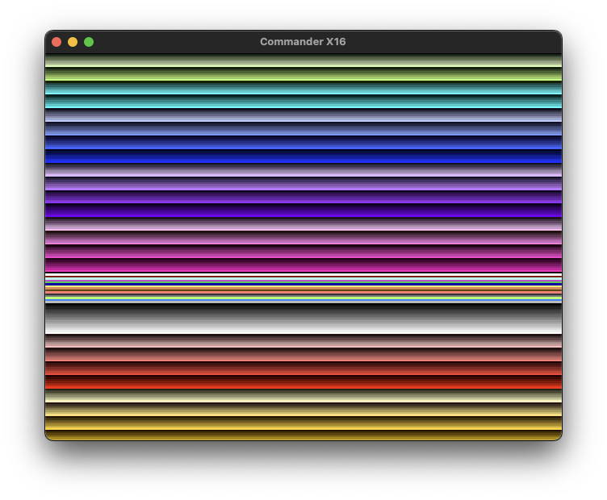

# Example X16 llvm-mos CMake C project

## Steps to build (and run) Commander X16 llvm-mos C example

This example assumes Linux, macOS or running a *nix like environment under Windows (Like MSYS2, WSL2 or Cygwin64).  You will also need CMake installed.  Typically you would use your package manager to install CMake (e.g., `apt-get install cmake`, `brew install cmake` or run an installer depending on OS).

- Download the llvm-mos-sdk package for your OS from <https://github.com/llvm-mos/llvm-mos-sdk/releases/latest>
- Un-zip or un-tar to the location of your choice and remember the path to that location (e.g.. `llvm-mos` in your home directory).
- Open a shell prompt in this examples directory (e.g., `x16-demo/clang`)

```sh
cd x16-demo/clang
```

- Generate the makefile by entering the following commands (change `~/llvm-mos` to where you unpacked the llvm-mos-sdk):

```sh
mkdir build
cd build
cmake -DCMAKE_PREFIX_PATH=~/llvm-mos ..
```

- To build the project, from the same shell, continue by entering the following command:

```sh
make
```

- To run programs in [x16-emulator](https://github.com/X16Community/x16-emulator/releases/latest), you can use a command similar to the following (this assumes `x16emu` is in your path, if not supply the full path):

```sh
x16emu -scale 2 -prg bitmap.prg -run
```



  You could also use another emulator (like [box16](https://github.com/indigodarkwolf/box16) or [BitMagic](https://github.com/Yazwh0/BitMagic)) or copy the `.prg` files to a FAT32 SD card for use on actual Commander X16 hardware.

-Xark
<Xark@XarkLabs.com>
<https://hackaday.io/Xark>
<https://github.com/XarkLabs>
